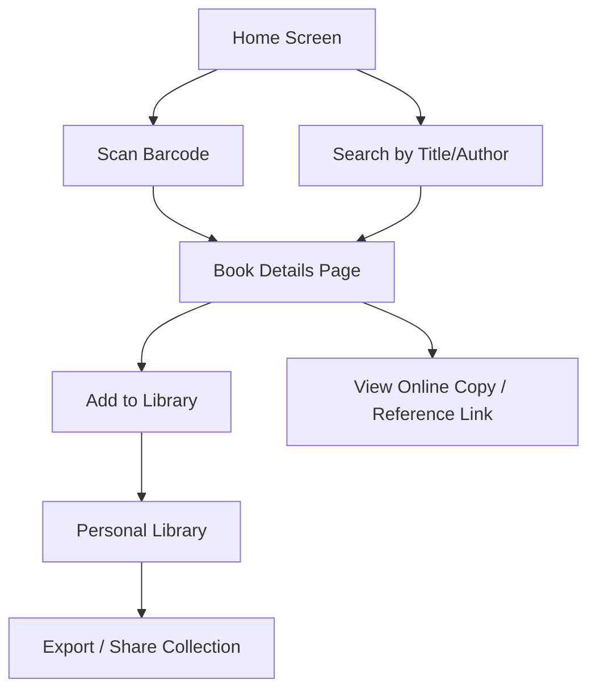
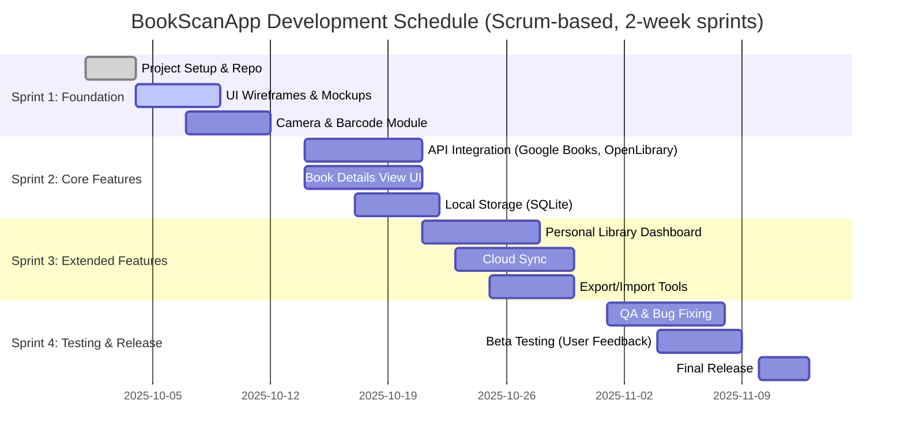

## Overview / Brief

**BookScanApp** is a mobile app that allows users to scan a barcode or ISBN of a book and instantly obtain a digital reference to it on their device. It can be used by individual readers to track and manage personal collections, by libraries to link books to digital versions, and by organizations to perform inventory management.

---

## Details

### Target Customer(s)
- **Primary:** College students, researchers, book enthusiasts.
- **Secondary:** Libraries, schools, second-hand bookstores, small publishers.

### (App Name) is...
The **BookScanApp** is a **mobile application for book cataloging and digital access**.

### Key Benefits, Unique Selling Points & Differentiating Factors
- Rapid scanning with OCR + barcode lookup.
- Integration with **open book APIs** (Google Books, Open Library).
- Syncs personal collections across devices.
- Option for libraries to create shared repositories.
- Offline scanning with queued sync once online.

### Comparison to existing options
- Unlike **Goodreads**, which is community/social-oriented, BookScanApp focuses on **utility and fast access**.  
- Unlike **library management software**, it’s lightweight and **accessible to individuals**.  
- Unlike **generic barcode scanners**, BookScanApp provides **direct book metadata and digital links**.

### Features Overview
- **Barcode & ISBN scanning**
- **Search by title/author (manual input)**
- **Book metadata retrieval** (author, publisher, year, description)
- **Personal library tracking**
- **Cloud sync**
- **Library/institution mode**: bulk scanning, inventory
- **Export/Import data (CSV, JSON)**

---

## Documentation

### UI Mockups

---

### Project Scope
**Functional Scope**
- Implement mobile app (iOS/Android).
- Core scanning (camera access, barcode decoding).
- API integration (Google Books, Open Library).
- Local + cloud storage.
- Basic export and report generation.

**Out of Scope (for MVP)**
- Social features (reviews, likes).
- Advanced analytics.
- Marketplace or book selling.

---

### Scheduling

---

### Risks
- **Complexity:** Handling multiple book metadata sources & inconsistencies.
- **Technical:** OCR accuracy for damaged ISBNs or poor lighting.
- **Integration:** API limits and licensing.
- **Adoption:** Competing with entrenched platforms (Goodreads, Libib).

---

### Feasibility
- **High technical feasibility** (barcode scanning and APIs are well-documented).
- **Medium adoption feasibility** (will depend on UX simplicity and differentiators like offline mode and export tools).
- MVP is achievable within ~2 months of focused Scrum sprints.

---

### Tools, Libraries, etc.

#### Hardware
- Smartphones with cameras (Android/iOS).
- Optional: tablets for libraries.
- Server backend for sync (cloud-hosted, e.g., AWS, Firebase).

#### Software
- **Frontend:** React Native / Flutter.
- **Backend:** Node.js / Firebase.
- **Database:** SQLite (local), Firestore (cloud).
- **APIs:** Google Books API, Open Library API.
- **Libraries:** 
  - ZXing or ML Kit (barcode scanning)
  - Axios (API calls)
  - Redux or Bloc (state management)
- **Testing:** Jest, Detox for mobile integration tests.
